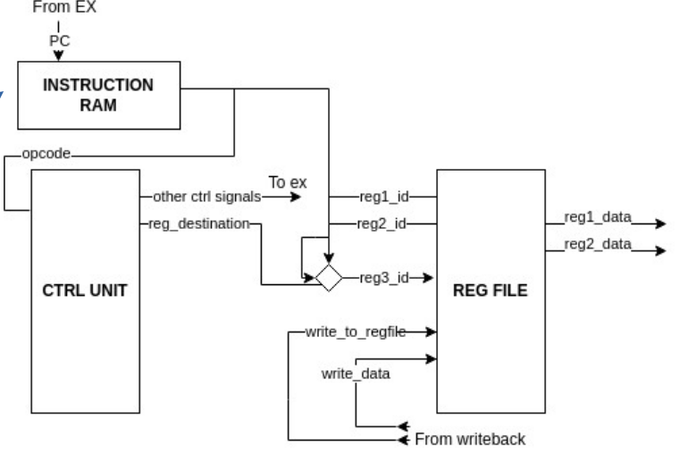
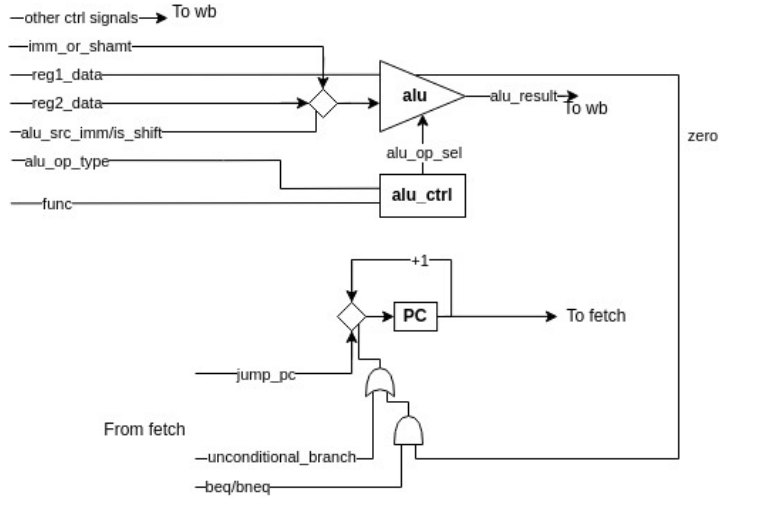
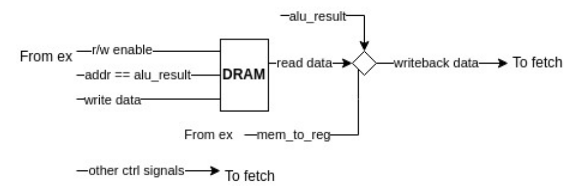
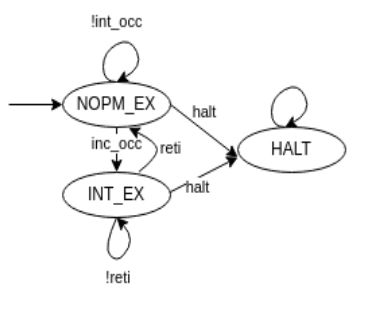

Basic MIPS implementation in verilog.
Mips is based on Hennessy & Patterson description. 

> 32 general purpose 32 bit registers
> unsigned integer instructions 
    > add, sub, mul, shift
> logic instructions
    > and, or, not
> immediate instructions
    > addi, subi
> mem instructions
    > lw, sw
> branch instructions
    > beq, bneq, unconditional branch

The original MIPS has a 5 stage pipeline, for simplicity this is a 3 stage pipeline.
Also this implementation has a basic interrupt mechanism.

The basic interrupt mechanism is controlled by the following FSM

