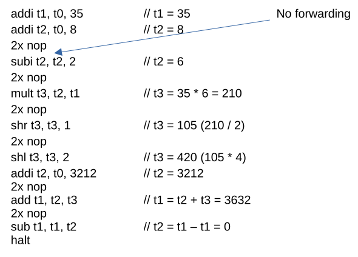
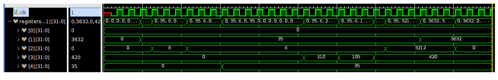
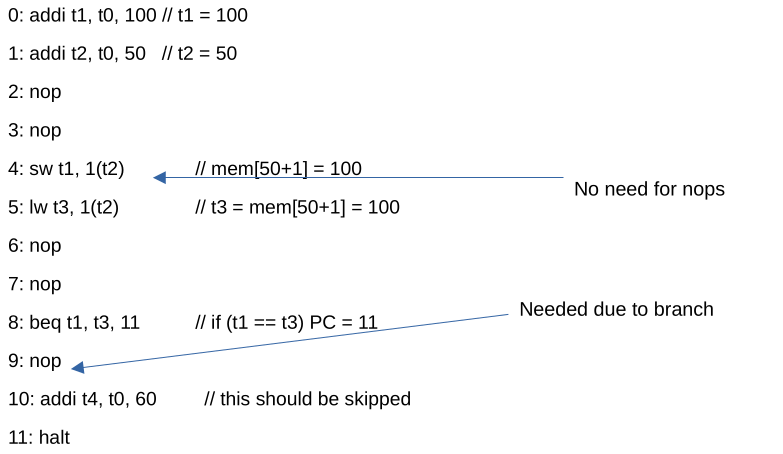
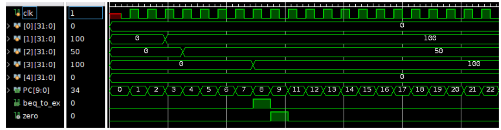
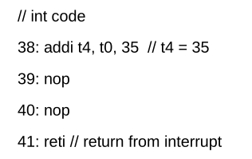
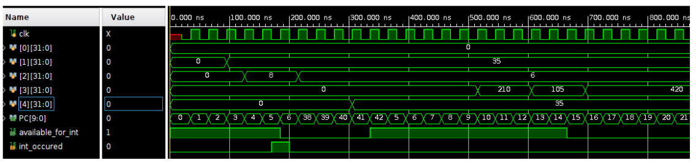

Basic MIPS implementation in verilog.
Mips is based on Hennessy & Patterson description. 

- 32 general purpose 32 bit registers
- unsigned integer instructions 
    - add, sub, mul, shift
- logic instructions
    - and, or, not
- immediate instructions
    - addi, subi
- mem instructions
    - lw, sw
- branch instructions
    - beq, bneq, unconditional branch

The original MIPS has a 5 stage pipeline, for simplicity this is a 3 stage pipeline.
Also this implementation has a basic interrupt mechanism.

<figure>
    <figcaption>Fetch-Decode stage</figcaption>
  
</figure>

<figure>
    <figcaption>Execute stage</figcaption>
  
</figure>

<figure>
    <figcaption>Memory-Writeback stage</figcaption>
  
</figure>

The basic interrupt mechanism is controlled by the following FSM
<figure>
    <figcaption>Interrupt FSM</figcaption>
  
</figure>
 

Following are three basic tests done. One for math ops, one for mem and branch ops and one for an interrupt test.
<figure>
    <figcaption>Math ops test</figcaption>
  
</figure>

<figure>
    <figcaption>Math ops output</figcaption>
  
</figure>

<figure>
    <figcaption>Memory and Branch test</figcaption>
  
</figure>

<figure>
    <figcaption>Mem and Branch test output</figcaption>
  
</figure>

<figure>
    <figcaption>Interrupt test</figcaption>
  
</figure>

<figure>
    <figcaption>Mem and Branch test output</figcaption>
  
</figure>
